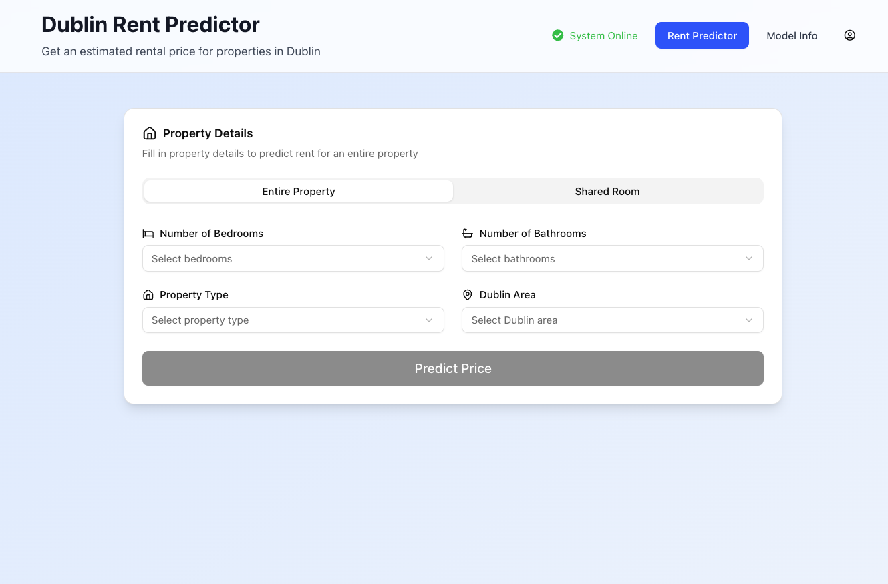

# Dublin Rent Price Estimator



## Features
- Estimate the price of a property or shared room in Dublin.
- See model stats in the Model Info tab.
- Sign up and login to save your search history.

## Tech Stack
- Next.js 15
- Shadcn
- FastAPI
- Scikit-learn
- PostgreSQL
- Docker

# How to run the application

1. Add a src/.env file with the following content:

```
POSTGRES_USER=postgres
POSTGRES_PASSWORD=postgres
POSTGRES_DB=db
POSTGRES_PORT=5432

DATABASE_URL="postgresql+asyncpg://postgres:postgres@db:5432/db"

SECRET_KEY="secret"
```
2. Run this command from the `src` directory:

```bash
docker compose up -d
```

3. Go to http://localhost:3000 to see the application.
